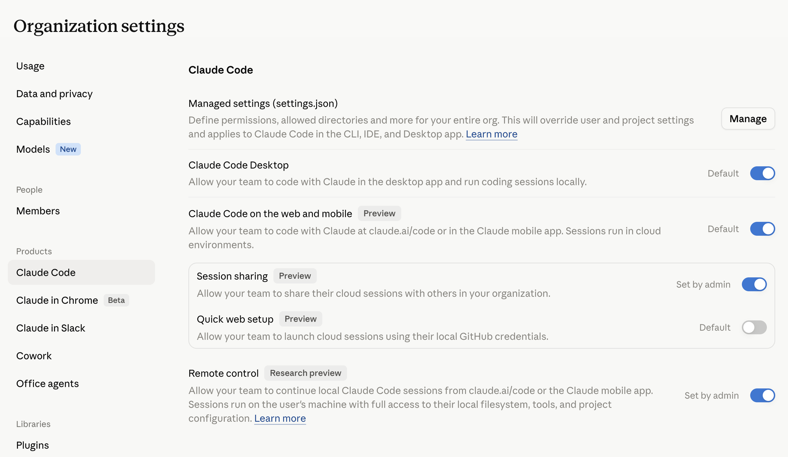

# Connecting Claude Code to the ClaudeCosts gateway

ClaudeCosts works by sitting **in front of** Claude Code: instead of talking to Anthropic directly, Claude Code sends its traffic to the ClaudeCosts gateway, which meters every call and then forwards it on. The only thing you have to configure on the Claude Code side is the **API base URL**.

You point Claude Code at the gateway by setting:

```
ANTHROPIC_BASE_URL = https://<ADDRESS>:<PORT>
```

- `<ADDRESS>` — where the gateway is reachable (e.g. `localhost` for a local stack, or your gateway host/domain).
- `<PORT>` — the gateway port, i.e. `CLAUDE_GATEWAY_PORT` from your [docker-compose.yml](../docker-compose.yml) (default `8080`).

There are two ways to apply this, depending on whether you're setting it up for **yourself** or rolling it out across an **organization**.

---

## Option A — Individual user

Best for trying ClaudeCosts on your own machine, or for a single developer.

Set the `ANTHROPIC_BASE_URL` environment variable so Claude Code routes through the gateway.

**One-off (current shell):**

```bash
export ANTHROPIC_BASE_URL=https://<ADDRESS>:<PORT>
claude
```

For a local stack started with `CLAUDE_GATEWAY_PORT=9090`, that's:

```bash
export ANTHROPIC_BASE_URL=http://localhost:9090
```

**Persistent (every new shell):** add the same line to your shell profile — `~/.zshrc`, `~/.bashrc`, etc.

```bash
echo 'export ANTHROPIC_BASE_URL=http://localhost:9090' >> ~/.zshrc
```

**User-level (all your projects):** Claude Code reads environment variables from your personal settings file at `~/.claude/settings.json`. Setting it here routes every Claude Code session for your user account through the gateway, regardless of which project you're in — no shell profile edit needed.

```json
{
  "env": {
    "ANTHROPIC_BASE_URL": "https://<ADDRESS>:<PORT>"
  }
}
```

**Per-project:** Claude Code also reads environment variables from `.claude/settings.local.json`, so you can scope the gateway to a single repo:

```json
{
  "env": {
    "ANTHROPIC_BASE_URL": "https://<ADDRESS>:<PORT>"
  }
}
```

To confirm it's working, run a Claude Code session and check that the calls show up in the ClaudeCosts dashboard.

To stop routing through the gateway, unset the variable (`unset ANTHROPIC_BASE_URL`) or remove it from your profile/settings.

---

## Option B — Enterprise / organization-wide

Best for rolling ClaudeCosts out to a whole team so **every** developer's Claude Code traffic is metered, without each person configuring their own machine.

This uses Anthropic's **managed settings** for Claude Code, which override user and project settings and apply to Claude Code across the CLI, IDE, and Desktop app.

### 1. Open managed settings

In the Anthropic Console, go to **Organization settings → Claude Code → Managed settings (settings.json)** and click **Manage**.



> Managed settings apply to your entire org and override user and project settings.

### 2. Add the gateway configuration

Set `ANTHROPIC_BASE_URL` to your gateway so all org members route through ClaudeCosts. The optional announcement gives users a visible heads-up that ClaudeCosts is active:

```json
{
  "companyAnnouncements": [
    "ClaudeCosts Enabled."
  ],
  "env": {
    "ANTHROPIC_BASE_URL": "https://<ADDRESS>:<PORT>"
  }
}
```

Replace `<ADDRESS>:<PORT>` with the address and port where your deployed gateway is reachable by your team (this should be a network-accessible host, not `localhost`).

### 3. Save and roll out

Once saved, the managed settings propagate to your organization's Claude Code installs. New sessions will route through the gateway automatically.

---

## Notes

- **Use a reachable address for teams.** `localhost` only works on the same machine as the gateway. For organization-wide use, deploy the gateway somewhere your team can reach (an internal host or domain) and use that as `<ADDRESS>`.
- **HTTPS in production.** For anything beyond local testing, terminate TLS in front of the gateway and use an `https://` base URL.
- **Verify in the dashboard.** After connecting, open the ClaudeCosts dashboard (`UI_PORT`, default `3000`) and confirm sessions and costs are showing up.
